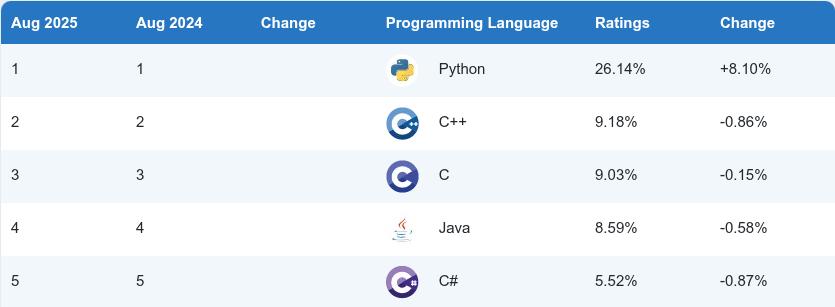

# Основы программирования<br>Лекция 1. Введение

Введение. Ввод-вывод. Переменные. Типы данных. Операторы. Строки.

---

# О курсе

::center
{width=450px}
::

---

# Система оценивания и структура курса

<v-clicks depth="2">

- бально-рейтинговая система
- максимум 10 баллов
  - Неудовлетворительно: 0-3
  - Удовлетворительно: 4-5
  - Хорошо: 6-7
  - Отлично: 8-10
- 50% практические работы (~14 работ)
- 50% зачет

</v-clicks>


---

# Язык Python

- Создан в 1991 г.
- Создатель: Гвидо Ван Россум
- Мультипарадигменный 
  - ООП 
  - структурное
  - функциональное, 
  - метапрограммирование
- Интерпретируемый (cpython)
- Использует динамическую типизацию
- Официальный репозиторий: github.com/python
- Официальная документация: docs.python.org

---

# Рейтинг TIOBE 

::center

::

---
layout: fact
---

# Zen of Python

Дзен языка Python всегда можно посмотреть, вызвав
интерпретатор и выполнив код `import this`

---

# Zen of Python

::div{style="column-count: 2;"}

  1. Beautiful is better than ugly.
  2. Explicit is better than implicit.
  3. Simple is better than complex.
  4. Complex is better than complicated.
  5. Flat is better than nested.
  6. Sparse is better than dense.
  7. Readability counts.
  8. Special cases aren't special enough to break the rules.
  9. Although practicality beats purity.
  10. Errors should never pass silently.
  11. Unless explicitly silenced.
  12. In the face of ambiguity, refuse the temptation to guess.
  13. There should be one-- and preferably only one --obvious way to do it.
  14. Although that way may not be obvious at first unless you're Dutch.
  15. Now is better than never.
  16. Although never is often better than *right* now.
  17. If the implementation is hard to explain, it's a bad idea.
  18. If the implementation is easy to explain, it may be a good idea.
  19. Namespaces are one honking great idea -- let's do more of those!

::

---

# Zen of Python

::div{style="column-count: 2; font-size: 0.95em;"}

1. Красивое лучше, чем уродливое.
2. Явное лучше, чем неявное.
3. Простое лучше, чем сложное.
4. Сложное лучше, чем запутанное.
5. Плоское лучше, чем вложенное.
6. Разреженное лучше, чем плотное.
7. Читаемость имеет значение.
8. Особые случаи не настолько особые, чтобы нарушать правила.
9. При этом практичность важнее безупречности.
10. Ошибки никогда не должны замалчиваться.
11. Если они не замалчиваются явно.
12. Встретив двусмысленность, отбрось искушение угадать.
13. Должен существовать один и, желательно, только один очевидный способ сделать это.
14. Хотя он поначалу может быть и не очевиден, если вы не голландец.
15. Сейчас лучше, чем никогда.
16. Хотя никогда зачастую лучше, чем *прямо* сейчас.
17. Если реализацию сложно объяснить — идея плоха.
18. Если реализацию легко объяснить — идея, возможно, хороша.
19. Пространства имён — отличная штука! Будем делать их больше!

::


---

# Код на Python

````md magic-move {maxHeight:'420px'}

```python
print("Hello, World!")
```

```python
print(Hello, World!)
```

```python
print("Добро пожаловать на курс Основы программирования!")
print("Для начала научимся работать с командой print.")
print("Это программа выведет на экран 3 строки.")
```

````

Вывод:

````md magic-move {at:1, lines: false}

```console
Hello, World!
```

```console
File "", line 1
  print(Hi there!)
                   ^
SyntaxError: invalid syntax
```

```console
Добро пожаловать на курс Основы программирования!
Для начала научимся работать с командой print.
Это программа выведет на экран 3 строки.
```

````

---

# Арифметические операции

````md magic-move {maxHeight:'420px'}
```python
print(2 + 5)
print(3 * 3)
print(2 + 2 * 10)
```

```python
print(2 + 2 * 10)
print("2 + 2 * 10")
```
````

Вывод:

````md magic-move {at:1, lines: false}

```console
7
9
22
```

```console
22 
2 + 2 * 10
```
````

---

# Комментарии

````md magic-move {maxHeight:'420px'}

```python
print("Часов в году:")
# в году 365 дней, в каждом дне 24 часа
print(365 * 24)
```

```python
print("Часов в году:")
print(365 * 24) # в году 365 дней, в каждом дне 24 часа
```
````

Вывод:

````md magic-move {at:1, lines: false}

```console
Hours in a year:
8760
```

```console
Hours in a year:
8760
```
````

---

# Ввод

````md magic-move
```python
name = input("Введите ваше имя: ")
print("Привет," + name + "!")
```
```python
name = input("Введите ваше имя: ")
print("Привет," + name + "!")
```
```python
name = input("Введите ваше имя: ")
print("Привет," + name + "!")
```

```python
name = input("Введите ваше имя: ")
print("Привет," + name + "!")
print(name + " - отличное имя!")
```

```python
name = input("Введите ваше имя: ")
print("Привет," + name + "! Давай проверим, тебя зовут " + name + "?")
```
````

Вывод:

````md magic-move {at:1, lines: false}

```console
Введите ваше имя: Поликарп
Привет, Поликарп!
```

```console
Введите ваше имя: 123
Привет, 123!
```

```console
Введите ваше имя: !@#$%^&
Привет, !@#$%^&!
```
```console
Введите ваше имя: Поликарп
Привет, Поликарп!
Поликарп - отличное имя!
```

```console
Введите ваше имя: Поликарп
Привет, Поликарп! Давай проверим, тебя зовут Поликарп?
```
````

---

# Ввод

````md magic-move {maxHeight:'420px'}
```python
name = input("Введите ваше имя: ")
email = input("Введите ваш email: ")
nickname = input("Введите ваш никнейм: ")

print("Привет, " + name + "!")
print("Твой email: " + email)
print("Твой никнейм: " + nickname)
```

```python
address = input("Введите ваш адрес: ")
print("Ваш адрес: " + address)

address = input("Введите новый адрес: ")
print("Ваш адрес: " + address)
```

```python
address = input("Введите ваш адрес: ")
address = input("Введите новый адрес: ")
print("Ваш адрес: " + address)
```
````

Вывод:

````md magic-move {at:1, lines: false}

```console
Введите ваше имя: Поликарп
Введите ваш email: polykarp@mail.com
Введите ваш никнейм: poly
Привет, Поликарп!
Твой email: polykarp@mail.com
Твой никнейм: poly
```

```console
Введите ваш адрес: ул. Ленина, д. 1
Ваш адрес: ул. Ленина, д. 1
Введите новый адрес: ул. Пушкина, д. 2
Ваш адрес: ул. Пушкина, д. 2
```

```console
Введите ваш адрес: ул. Ленина, д. 1
Введите новый адрес: ул. Пушкина, д. 2
Ваш адрес: ул. Пушкина, д. 2
```
````

---

# Переменные

````md magic-move {maxHeight:'420px'}
```python
variable_name = ...
```

```python
name = input("Введите ваше имя: ")

print("Привет," + name + "!")
```

```python
name = "Поликарп"
surname = "Петров"

full_name = name + " " + surname

print(full_name)
```

```python
word = "Hello"
print(word)

word = "World"
print(word)

word = "!"
print(word)
```

```python
word = "Hello"
print(word)

word = word + ", World!"
print(word)
```
````

---

# Имена переменных

<v-clicks>

- Состоят из букв, цифр и символов подчеркивания
- Не могут начинаться с цифры
- Чувствительны к регистру (`Variable`, `variable` и `VARIABLE` - разные переменные)
- Не могут быть ключевыми словами языка Python (например, `if`, `for`, `while`, `import` и т.д.)
- Рекомендуется использовать "говорящие" имена (например, `user_name` вместо `un`)
- Рекомендуется использовать стиль `snake_case` (слова разделяются символом подчеркивания)
- Рекомендуется использовать английские имена (хотя это не обязательно)
- Рекомендуется использовать строчные буквы (хотя это не обязательно)
- Рекомендуется избегать слишком длинных имен (хотя это не обязательно)
- Рекомендуется избегать слишком коротких имен (хотя это не обязательно)
- Рекомендуется избегать имен, которые могут быть легко спутаны (например, `l` и `1`, `O` и `0`)

</v-clicks>

---

# Целые числа (`int`)

````md magic-move {maxHeight:'420px'}
```python
age = 25

print(age)
```

```python
number1 = 10
number2 = "15"

print(number1)
print(number2)
```

```python
number1 = 10
number2 = "15"

print(number1 + number1)
print(number2 + number2)
```

```python
number = "10"

print(number / 2)
```

````

Вывод:

````md magic-move {at:1, lines: false}
```console
25
```
```console
10
15
```

```console
20
1515
```

```console
Traceback (most recent call last):
  File "<stdin>", line 1, in <module>
TypeError: unsupported operand type(s) for /: 'str' and 'int'
```

````

---

# Объединение значений при выводе

````md magic-move {maxHeight:'420px'}
```python
result = 10 * 25

print("Результат равен " + result)
```
```python
result = 10 * 25

print("Результат равен " + str(result))
```

````

Вывод:

````md magic-move {at:1, lines: false}
```console
Traceback (most recent call last):
  File "<stdin>", line 1, in <module>
TypeError: can only concatenate str (not "int") to str
```

```console
Результат равен 250
```

````

---

# Интерполяция строк (f-строки)

````md magic-move {maxHeight:'420px'}
```python
result = 10 * 25

print(f"Результат равен {result}")
```

```python
name = "Поликарп"
age = 25
city = "Сириус"

print("Меня зовут", name, ", мне", age, "лет и я живу в", city)
```

```python
name = "Поликарп"
age = 25
city = "Сириус"

print(f"Меня зовут {name}, мне {age} лет и я живу в {city}")
```
````

Вывод:

````md magic-move {at:1, lines: false}
```console
Результат равен 250
```

```console
Меня зовут Поликарп , мне 25 лет и я живу в Сириус
```

```console
Меня зовут Поликарп, мне 25 лет и я живу в Сириус
```

````

---

# `float`

````md magic-move {maxHeight:'420px'}
```python
number1 = 2.5
number2 = -1.25
number3 = 3.62

mean = (number1 + number2 + number3) / 3
print(f"Mean: {mean}")
```

````

Вывод:

````md magic-move {at:1, lines: false}
```console
Mean: 1.6233333333333333
```
````

---

# Арифметические операции

| Оператор | Действие | Пример | Результат |
| :---: | --- | :----: | :---: |
| + | Сложение | `4 + 2` | `6` |
| - | Вычитание | `10 - 2.5` | `7.5` |
| * | Умножение | `-2 * 123` | `-246` |
| / | Деление  | `9 / 2` | `4.5` |
| // | Целочисленное деление | `9 // 2` | `4` |
| % | Остаток от деления | `9 % 2` | `1` |
| ** | Возведение в степень | `2**3` | `8` |

---

# Порядок выполнения операций

1. Скобки `()`
2. Возведение в степень `**`
3. Умножение `*`, Деление `/`, Целочисленное деление `//`, Остаток от деления `%`
4. Сложение `+`, Вычитание `-`
5. Операции выполняются слева направо

---

# Приведение типов

````md magic-move {maxHeight:'420px'}
```python
number1 = "10"
number2 = 5

print(number1 + number2)
```

```python
number1 = "10"
number2 = 5

print(int(number1) + number2)
```

```python
number1 = "10.5"
number2 = 5

print(float(number1) + number2)
```

```python
number1 = 105

print(str(number1) + " is a number")
```

```python
number1 = input("Enter a number: ")
number1 = int(number1)

print(f"You entered: {number1}, which is of type {type(number1)}")
print(number1 + 5)
```

```python
number1 = int(input("Enter a number: "))

print(f"You entered: {number1}, which is of type {type(number1)}")
print(number1 + 5)
```
````

Вывод:

````md magic-move {at:1, lines: false}

```console
Traceback (most recent call last):
  File "<stdin>", line 1, in <module>
TypeError: can only concatenate str (not "int") to str
```

```console
15
```

```console
15.5
```

```console
105 is a number
```

```console
Enter a number: 20
You entered: 20, which is of type <class 'int'>
25
```
````