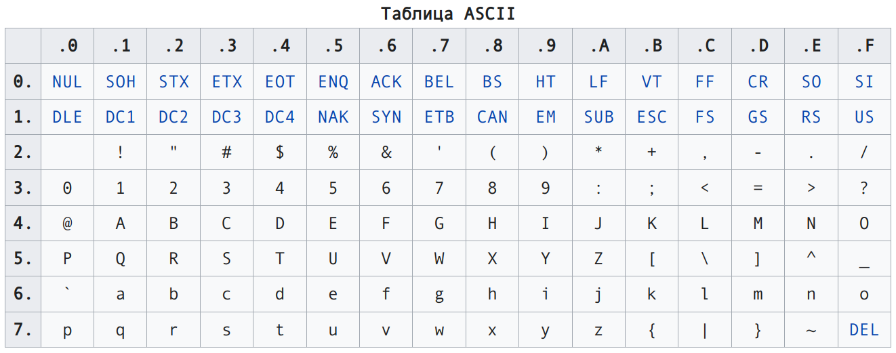

# Основы программирования<br>Лекция 2. 

Строки. Списки. Оператор ветвления.

---

# Строки

- Неизменяемый итерируемый тип данных
- Могут быть объявлены разными способами
- Поддерживают синтаксис срезов (так же, как и списки)
- Поддерживают специальные символы
- Поддерживают интерполяцию
- Поддерживают форматирование
- Отдельные символы имеют кодировку по таблице ASCII или Unicode

---

::center

::

---

# Строки. Способы объявления


````md magic-move{maxHeight:'400px'}
```py
# Строки могут быть заключены как в одинарные, так и в двойные кавычки
message = 'hello'

recepient = "world"
```
```py
# Длинные строки можно заключить в любые кавычки, повторенные трижды
greeting = """
    - Hello
      there!
"""

answer = '''
    - General
      Kenobi!
'''

```
```py
# Строки могут быть перенесены в коде с помощью символа переноса
same_dialogue = 'hello \
  again'
```
````
---

# Индексы и срезы (slices)

- Получение символа из строки имеет следующий синтаксис: `имя_переменной[индекс]`
- Срез имеет синтаксис: `имя_переменной[начало:конец:шаг]`

<br><br><br>

<v-click>

::center
  :::span{style="font-size: 1.5em; width: 100%;"}
    При этом начало включено, конец - нет!
  :::
::

</v-click>

---

# Индексы и срезы (slices). Примеры

::div{style="font-size: 0.9em;"}

| Последовательность | a | b | c | d | e | f | g | Результат |
| --- | :---: | :---: | :---: | :---: | :---: | :---: | :---: | --- |
| Индексы | 0(-7) | 1(-6) | 2(-5) | 3(-4) | 4(-3) | 5(-2) | 6(-1) |  |
| `[:]` | + | + | + | + | + | + | + | abcdefg |
| `[::-1]` | + | + | + | + | + | + | + | gfedcba |
| `[::2]` | + |  | + |  | + |  | + | aceg |
| `[1::2]` | | + |  | + |  | + |  |  bdf |
| `[:1]` | + |  |  |  |  |  |  | a |
| `[-1:]` |  |  |  |  |  |  | + | g |
| `[3:4]` |  |  |  | + |  |  |  | d |
| `[-3:]` |  |  |  |   | + | + | + | efg |
| `[-3:1:-1]` |  |  | + | + | + |  |  | edc |
| `[2:5]` |  |  | + | + | + |  |  | cde |

::

---

# Специальные экранируемые символы в строках


| Символ | Описание |
| :---: | --- |
| `\` в самом конце строки | Игнорируется, строка продолжается на новой строке |
| `\\` | Сам символ обратного слеша (остается один символ \) |
| `\'` | Апостроф (остается один ‘) |
| `\"` | Кавычка (остается один символ ") |
| `\n` | Новая строка (перевод строки) |
| `\r` | Возврат каретки |
| `\t` | Горизонтальная табуляция |

Если вы хотите, чтобы обратный слеш игнорировался, можете использовать **raw string** ("сырую" строку). Пример:

::center
  ```py
  path = r'\path\to\folder\'
  ```
::

---

# Методы строк

| Метод | Описание | Пример |
|-------|----------|--------|
| `str.upper()` | Преобразует строку в верхний регистр | `"hello".upper() → "HELLO"` |
| `str.lower()` | Преобразует строку в нижний регистр | `"HELLO".lower() → "hello"` |
| `str.capitalize()` | Первый символ в верхний регистр, остальные - нижний | `"hello".capitalize() → "Hello"` |
| `str.title()` | Каждое слово с заглавной буквы | `"hello world".title() → "Hello World"` |
| `str.strip()` | Удаляет пробелы с обоих концов | `" hello ".strip() → "hello"` |
| `str.lstrip()` | Удаляет пробелы слева | `" hello ".lstrip() → "hello "` |
| `str.rstrip()` | Удаляет пробелы справа | `" hello ".rstrip() → " hello"` |
| `str.replace(old, new)` | Заменяет подстроку | `"hello".replace("l", "x") → "hexxo"` |

---

# Методы строк

| Метод | Описание | Пример |
|-------|----------|--------|
| `str.split(sep)` | Разделяет строку по разделителю | `"a,b,c".split(",") → ["a", "b", "c"]` |
| `str.join(iterable)` | Объединяет элементы через строку | `",".join(["a", "b"]) → "a,b"` |
| `str.startswith(prefix)` | Проверяет начало строки | `"hello".startswith("he") → True` |
| `str.endswith(suffix)` | Проверяет конец строки | `"hello".endswith("lo") → True` |
| `str.find(sub)` | Ищет подстроку, возвращает индекс | `"hello".find("l") → 2` |
| `str.rfind(sub)` | Ищет подстроку с конца | `"hello".rfind("l") → 3` |
| `str.index(sub)` | Как find(), но вызывает ошибку | `"hello".index("l") → 2` |
| `str.count(sub)` | Считает количество вхождений | `"hello".count("l") → 2` |
| `str.isalpha()` | Только буквы? | `"hello".isalpha() → True` |
| `str.isdigit()` | Только цифры? | `"123".isdigit() → True` |

---

# Методы строк

| Метод | Описание | Пример |
|-------|----------|--------|
| `str.isalnum()` | Буквы или цифры? | `"abc123".isalnum() → True` |
| `str.islower()` | Все символы в нижнем регистре? | `"hello".islower() → True` |
| `str.isupper()` | Все символы в верхнем регистре? | `"HELLO".isupper() → True` |
| `str.isspace()` | Только пробельные символы? | `"   ".isspace() → True` |
| `str.zfill(width)` | Дополняет нулями слева | `"42".zfill(5) → "00042"` |
| `str.center(width)` | Центрирует строку | `"hi".center(5) → " hi  "` |
| `str.ljust(width)` | Выравнивает по левому краю | `"hi".ljust(5) → "hi   "` |
| `str.rjust(width)` | Выравнивает по правому краю | `"hi".rjust(5) → "   hi"` |

<br>

<v-click>

> **Важно!** Так как строки являются неизменяемым типом все методы <span v-mark.underline.red="{multiline: true, at: 2}" >возвращают новую строку</span>, а не изменяют существующую.

</v-click>

---

# Структуры данных

- Структуры данных описывают точку зрения пользователя на представление данных.
- Любая структура данных имеет ограниченный набор операций, которые на этой структуре можно выполнять.
- Структура данных имеет ряд условных правил (ограничений), определяющих соответствие данных этой структуре

---

# Структуры данных в Python

В языке Python существует ряд основных структур данных:

- Списки (lists);
- Кортежи (tuples);
- Словари (dictionaries);
- Множества (sets).

---
layout: section
---

# Список (list)

---
layout: image

image: ./img/lection_2/image.png
backgroundSize: contain
---


---

# Список (list)

- Список служит для того, чтобы хранить объекты (данные) в определенном порядке, особенно если порядок или содержимое могут изменяться.
- Списки можно изменять: можно добавить или удалить элементы, а также перезаписать существующие.
- Примеры списков:

```python
>> empty_list  = []
>> numbers = [1, 2, 3, 4, 5]
```

Также список можно объявить с помощью `list()` :

```py
>> new_empty_list = list()
```

---

# Инициализация списка

Создать список определенного размера и сразу заполнить его значениями можно с помощью оператора умножения (`*`)

````md magic-move {lines:false}
```python
>> zeros = [0] * 5
>> zeros
[0, 0, 0, 0, 0]
```
```python
>> ones = [1] * 5
>> ones
[1, 1, 1, 1, 1]
```
```python
>> repetition = [1, 2, 3] * 3
>> repetition
[1, 2, 3, 1, 2, 3, 1, 2, 3]
```
````

---

# Создание списков

Список также можно получить из других итерируемых типов данных.

Например, из строки:

```python
>> list('cat')
['c', 'a', 't']
```

Или из кортежа (tuple):

```python
>> new_tuple = ('1', '2', '3')
>> list(new_tuple)
['1', '2', '3']
```

---

# Создание списков

Также многие стандартные функции возвращают список.

Например, функция `split()` применительно к строке разбивает эту строку на сегменты, по указанному пользователем разделителю, или же по пробелу, если таковой не указан:

```python
>> today = '25/07/2021'
>> today.split('/')
['25', '07', '2021']
```

---

# Получение элементов списка

Получить элемент списка можно, указав его смещение:

```python
>> numbers = ['0', '5', '10']
>> numbers[1]
'5'
```

Не забывайте, что индексация элементов начинается с нуля, а отрицательные индексы отсчитываются с конца строки:

```python
>> numbers[-1]
'10'
```

---

# Вложенные списки (nested lists)

В качестве значений списки могут содержат другие списки. Например, у нас есть список маленьких птиц, а есть список птиц побольше.


```python
>> small_birds = ['hummingbird', 'sparrow']
>> bigger_birds = ['pigeon', 'crow']

```

Объявим список `all_birds`, содержащий всех наших птиц:
```python
>> all_birds = [small_birds, bigger_birds]
>> all_birds
[['hummingbird', 'sparrow'], ['pigeon', 'crow']]
```


---

# Изменение элемента списка

Элемент списка можно изменить, также обратившись к нему по его смещению:

```python
>> words = ['hello', 'world']
>> words[1] = 'python'
>> words
['hello', 'python']
```

---

# Извлечение элементов с помощью диапазона смещений

Из списка можно извлечь последовательность, использовав диапазон смещений (срез):

```python
>> numbers = [0, 1, 2, 3, 4, 5]
>> numbers[0:2]
[0, 1]
>> numbers[::-1]
[5, 4, 3, 2, 1, 0]
```

---

# Добавление элементов в список

<v-clicks>

- С помощью метода `append()`:

```python
>> numbers.append(6)
[0, 1, 2, 3, 4, 5, 6]
```

- С помощью оператора `+=`:

```python
>> numbers += [7]
[0, 1, 2, 3, 4, 5, 6, 7]
```

- С помощью метода `extend()` (добавление списка к существующему):

```python
>> numbers.extend([8,  9])
[0, 1, 2, 3, 4, 5, 6, 7, 8, 9]
```

- С помощью метода `insert()`:

```python
>> numbers.insert(0,  -1)
[-1, 0, 1, 2, 3, 4, 5, 6, 7, 8, 9]
```
</v-clicks>

---

# Удаление элементов из списка

<v-clicks>

- C помощью `del` (удаление по индексу):

```python
>> del numbers[0]
[0, 1, 2, 3, 4, 5, 6, 7, 8, 9]
```

- С помощью `remove()` (удаление по значению):

```python
>> numbers.remove(8)
[0, 1, 2, 3, 4, 5, 6, 7, 9]
```

Удаляется только первое
вхождение элемента. Если элемент не найден, генерирует исключение
`ValueError`

- С помощью `clear()`:

```python
>> numbers.clear()
[]
```

</v-clicks>

---

# Удаление элементов из списка

- С помощью метода `pop([index])`, возвращающей элемент по указанному индексу и удаляющей его из списка:

```python
>> numbers.pop(0)
0
>> numbers
[1, 2, 3, 4, 5, 6, 7, 9]
```

Параметр `index` по умолчанию равен `-1`, поэтому функция `pop()` возвращает последний элемент списка.

```python
>> numbers.pop()
9
>> numbers
[1, 2, 3, 4, 5, 6, 7]
```

---

# Поиск элемента в списке

С помощью метода `index()`:

```python
>> numbers.index(7)
6
```

> Если элемент не найден, то будет выведено исключение `ValueError`.

С помощью метода `count()`:

```python
>> numbers.count(3)
1
```

---

# Сортировка списка

С помощью метода `sort([key, reverse])` или функции `sorted(list, [key, reverse])`.

Если параметры `key` и `reverse` не указаны, то сортируются элементы списка по неубыванию.

Параметр `reverse` указывает на то, что список должен быть отсортирован в обратном порядке.

````md magic-move {at:1}
```python
>> numbers = [3, 1, 2, 4, 5]
>> numbers.sort()
>> numbers
[1, 2, 3, 4, 5]
```

```python
>> numbers = [3, 1, 2, 4, 5]
>> numbers.sort()
>> numbers
[1, 2, 3, 4, 5]
>> numbers.sort(reverse=True)
>> numbers
[5, 4, 3, 2, 1]
```
````

---

# Сортировка списка

Параметр `key` указывает на то, что список должен быть отсортирован по функции `key`.

Функция `key` должна принимать один аргумент.

````md magic-move {at:1, lines:false}
```python
>> numbers = [3, 1, 2, 4, 5]
>> numbers.sort(key=lambda x: -x)
>> numbers
[5, 4, 3, 2, 1]
```

```python
>> numbers = [-3, 1, -2, 4, -5]
>> numbers.sort(key=lambda x: x ** 2)
>> numbers
[1, -2, -3, 4, -5]
```

```python
>> student_tuples = [
...     ('john', 'A', 15),
...     ('jane', 'B', 12),
...     ('dave', 'B', 10),
... ]
>> sorted(student_tuples, key=lambda student: student[2])
[('dave', 'B', 10), ('jane', 'B', 12), ('john', 'A', 15)]
```
````

---

# Функции списков

- `len()` - длина списка

```py
>> numbers = [0, 1, 2, 3, 4, 5, 6, 7, 8, 9]
>> len(numbers)
10
```

- `max()` - максимальное значение

```py
>> numbers = [0, 1, 2, 3, 4, 5, 6, 7, 8, 9]
>> max(numbers)
9
```

---

# Функции списков

- `min()` - минимальное значение

```py
>> numbers = [0, 1, 2, 3, 4, 5, 6, 7, 8, 9]
>> min(numbers)
0
```

- `sum()` - сумма значений

```python
>> numbers = [0, 1, 2, 3, 4, 5, 6, 7, 8, 9]
>> sum(numbers)
45
```

---

# Списковое включение (List comprehension)

Списковое включение – это некий синтаксический сахар, позволяющий упростить генерацию последовательностей (списков, множеств, словарей, генераторов).

```python
новый_список = [«операция» for «элемент списка» in «список»]
```

- операция подразумевает некие действия, которые вы собираетесь применить к каждому элементу списка;
- элемент списка – каждый отдельный объект списка;
- список – последовательность, элементы которой вы планируете подвергнуть операции (это не обязательно должен быть `list`, подойдет любой итерируемый объект).

```python {all|3|4|all}
>> old_prices = [120, 550, 410, 990]
>> discount = 0.15
>> new_prices = [int(product * (1 - discount)) for product in old_prices]
>> new_prices
[102, 467, 348, 841]
```

---

# Списковое включение <br> Условие в конце включения

```python
новый_список = [«операция» for «элемент списка» in «список» if «условие»]
```

Такой вариант использования условий позволяет отсечь часть элементов итератора. Новый список будет короче первоначального. По сути, к той же конструкции, которая приведена выше, добавляется условие if.

```python
>> numbers = [121, 544, 111, 99, 77]
>> number11 = [num for num in numbers if num % 11 == 0]
>> number11
[121, 99, 77]
```

> Следует обратить внимание, что условие может быть только одно (т. е. здесь невозможно использовать `elif`, `else` или другие `if`, как мы могли бы сделать в циклах).

---

# Списковое включение <br> Условие в начале включения

Если требуется не фильтрация данных по какому-то критерию, а изменение типа операции над элементами последовательности, условия могут использоваться в начале генератора списков.

```python
новый_список = [«операция» if «условие» for «элемент списка» in «список»]
```
<br>

```python {*}{wrapLines:true}
>> from string import ascii_letters
>> letters = 'hыtφтrцзqπ'
>> is_eng = [
...    f'{letter}-ДА' if letter in ascii_letters else f'{letter}-НЕТ'
...    for letter in letters
... ]
>> print(is_eng)
['h-ДА', 'ы-НЕТ', 't-ДА', 'φ-НЕТ', 'т-НЕТ', 'r-ДА', 'ц-НЕТ', 'з-НЕТ', 'q-ДА', 'π-НЕТ']
```

---

# Сложные списковые включения

```python
>> words = ['Я', 'изучаю', 'Python']
>> letters = [letter for word in words for letter in word]
>> letters
['Я', 'и', 'з', 'у', 'ч', 'а', 'ю', 'P', 'y', 't', 'h', 'o', 'n']
```

```python
>> table = [[x * y for x in range(1, 6)] for y in range(1, 6)]
>> table
[[1, 2, 3, 4, 5],
 [2, 4, 6, 8, 10],
 [3, 6, 9, 12, 15],
 [4, 8, 12, 16, 20],
 [5, 10, 15, 20, 25]]
```

---

# Оператор ветвления

````md magic-move
```python
if number > 0:
    print('Число больше нуля')
```

```python
if number > 0:
    print('Число больше нуля')
else
    print('Число меньше либо равно нулю')
```

```python
if number > 0:
    print('Число больше 0')
elif number == 0:
    print('Число равно 0')
else
    print('Число меньше 0')
```
````

::v-click{at=3}

В Python отсутствует конструкция `switch/case`. Однако начиная с Python 3.10 был введен оператор сопоставления с шаблонами (pattern matching statement) `match/case`.

::

---

# Операторы сравнения

| Оператор | Действие | Пример |
| :---: | --- | :---: |
| > | **Больше чем**: `True`, если левый операнд больше правого | `x > y`
| < | **Меньше чем**: `True`, если левый операнд меньше правого | `x < y`
| == | **Равно**: `True`, если операнды равны между собой | `x == y`
| != | **Не равно**: `True`, если операнды не равны между собой | `x != y`
| >= | **Больше или равно**: `True`, если левый операнд больше или равен правому | `x >= y`
| <= | **Меньше или равно**: `True`, если левый операнд меньше или равен правому | `x <= y`

---

# Логические операторы

| Оператор | Действие | Пример |
| :---: | :---: | :---: |
| and | **И**: `True`, если оба операнда `True` | `x and y`
| or | **ИЛИ**: `True`, если хотя бы один из операндов `True` | `x or y`
| not | **НЕ**: `True`, если операнд `False` | `not x`

---

# Операторы вхождения и тождественности

| Оператор | Действие | Пример |
| :---: | :---: | :---: |
| `in` | `True`, если значение или переменная есть в последовательности | `5 in x` |
| `not in` | `True`, если значения или переменной нет в последовательности | `5 not in x` |
| `is` | `True`, если операнды идентичны (указывают на один объект) | `x is true` |
| `is not` | `True`, если операнды не идентичны (не указывают на один объект) | `x is not true` |

---

# Ленивые операции

Логические операции `and` и `or` являются ленивыми, то есть вычисляют только столько операндов, сколько необходимо для получения результата.

```python
>> a = 0
>> b = 5
>> a != 0 and b / a > 5
False
```

В данном примере вторая часть выражения `b / a > 5` не вычисляется, так как первый операнд `a != 0` уже дал результат `False`, и для операции `and` этого достаточно.
